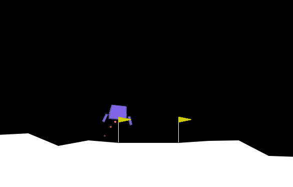
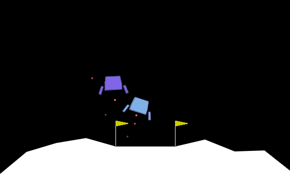

# Specialty-Exam

A repo for the scripts used in my specialty exam.

The scripts contained are developed and runnable on default VS-Code server
virtual machines on the ANT-center cluster. To set up the environment used
navigate to the desired directory on the host machine, and execute the
following commands:

```bash
conda create -n temp-env -y
conda init
exec $SHELL
conda activate temp-env
git clone https://github.com/bhosley/Specialty-Exam
cd Specialty-Exam
bash setup.sh
cd src
```

## Dr. Robbins Questions

```bash

```

### Multi-Agent Lunar Lander

<!-- markdownlint-disable MD033 -->
<p align="middle">
    
    &nbsp; &nbsp; &nbsp;
    
</p>

A demo of the custom multi-agent lander environment can be seen by navigating to the containing directory and calling the script name.

```bash
multi_lander.py
```

There are flags for changing the number of landers (default 2) and how
many iterations the demo you would like to see (default 1).

```bash
multi_lander.py --help
```

provides a guide for using these flags.
>*Note: The demo does not render in ANT containers, but should run smoothly on*
>*a local machine*
